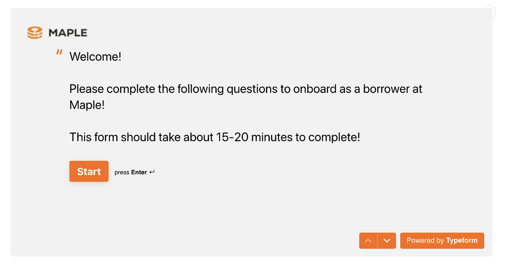
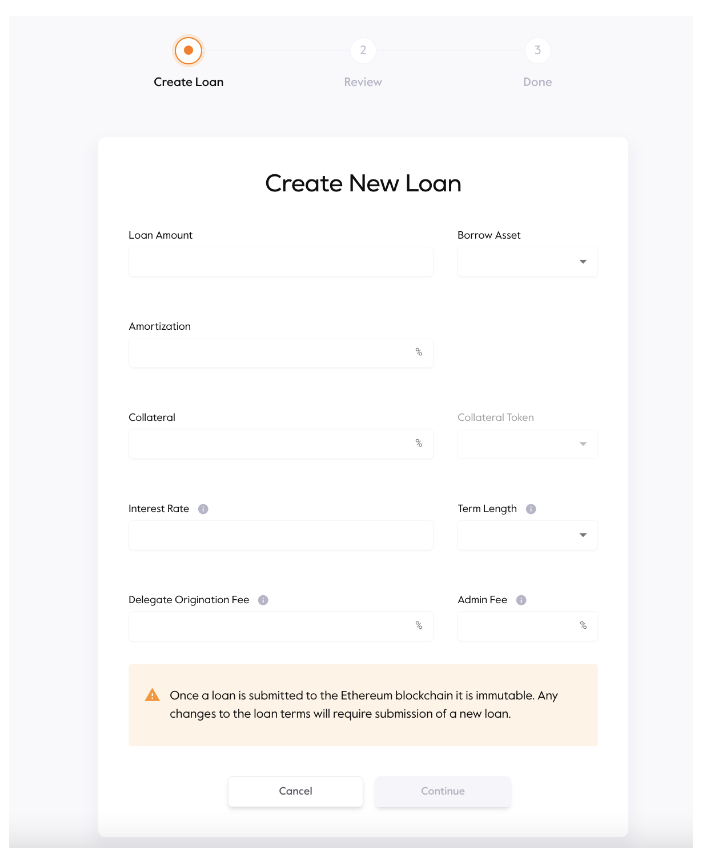
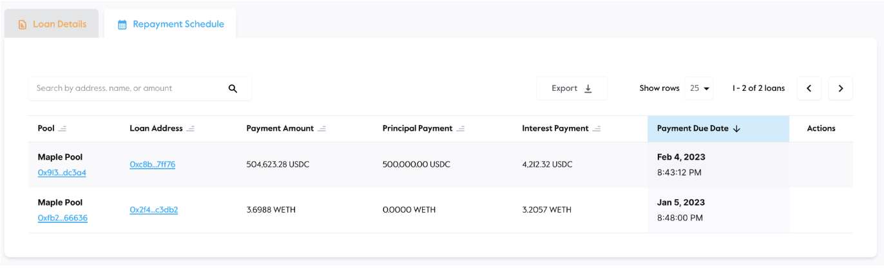

# Introduction

Maple offers borrowers a capital efficient option in decentralized lending. Those accepted by Pool Delegates must go through a pool-specific underwriting process prior to receiving their loan.

**How to Borrow**

1\. New borrowers on Maple will need to create an account and go through an approval process. Complete the type form in the “Borrow” tab on the WebApp and a member of the Maple team will be in touch to discuss next steps. Borrowers who have already completed this process simply can connect their wallet and view the Borrower Dashboard.

<figure><figcaption></figcaption></figure>

2\. Borrowers can view their full loan history including matured, active and unfunded loans on the dashboard.

<figure><figcaption></figcaption></figure>

3\. Once a borrower is approved on the platform, they are able to submit loan requests in pools. Before doing so, Delegates conduct financial due diligence on the borrower and agree to terms with the borrower off-chain. Borrowers then submit a new loan request on-chain that is viewable by Pool Delegates. Once the new loan request is submitted on chain it cannot be altered in any way. If there is an error a new loan request would need to be created.

<figure><figcaption></figcaption></figure>

4\. Once due diligence is completed, terms are agreed to, and the on-chain loan request is submitted, the Pool Delegate funds the loan by making the funds requested available for drawdown by the Borrower. It is at this point that the loan is finalised and the repayment schedule commences.

5\. Borrowers will return to the WebApp to make their interest repayments on a recurring basis and view the details of their loans on Maple. The final payment at the end of the loan term will prompt repayment of the principal balance.

<figure><figcaption></figcaption></figure>
