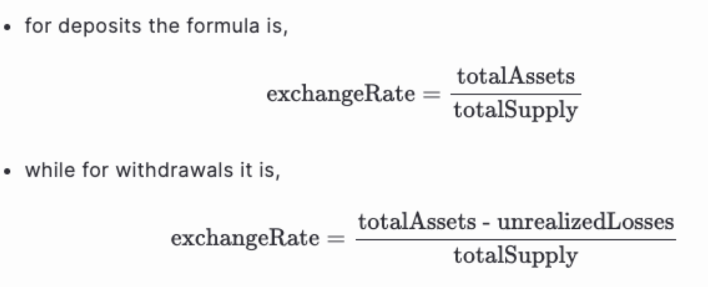

# Maple Loan Default & Impairment Procedure

### 1. Purpose

This procedure establishes the standard framework for managing borrower defaults, loan impairments, and collateral liquidations within Maple pools. The objective is to ensure:

* Protection of lender capital through conservative risk management.
* Transparent and fair handling of impairments via pool exchange rate adjustments.
* Effective pursuit of borrower recoveries to minimize realized losses.

All loans are overcollateralised and Maple has had hundreds of margin calls, one partial liquidation and no lender capital lost with over $5bn in loan originations.&#x20;

### 2. Scope

This procedure applies to:

* All Maple loans originated and managed on the Maple platform.
* All borrower events of default, including missed interest payments, liquidation shortfalls, and failure to repay post-liquidation.

### 3. Procedure

#### 3.1 Monitoring & Prevention

Automated Monitoring System

* Real-time feeds: Proprietary collateral management system integrates multiple independent price oracles, exchange APIs, and OTC indicative pricing.
* Risk thresholds: Each loan encodes Initial LTV, Margin Call LTV, and Liquidation LTV at origination. These are continuously tested against live market data.
* Automated alerts: Breach of Margin Call or Liquidation LTV thresholds generates automated alerts.

Escalation Logic

* Margin Call: If Margin Call LTV is breached, a 12–24 hour timer is started automatically. Borrowers receive standardized notices with clear collateral top-up or repayment instructions.
* Pre-liquidation staging: As the liquidation threshold approaches, trading counterparties (OTC desks, custodians) are pre-alerted, ensuring immediate execution capability if needed.
* Early Warning Indicators: News events, order book anomalies, and cross-venue liquidity shocks are integrated into dashboards to allow proactive risk management before thresholds are formally breached.

#### 3.2 Conditions for Liquidation&#x20;

Liquidation is authorized when:

1. Margin Call Cure Period window expires with loan still above Margin Call LTV; or
2. Liquidation LTV is breached
3. Event of Default under MLA&#x20;
4. Non-payment of principal, interest, or late fees.
5. Breach of covenants not cured within the grace period.
6. Insolvency or prohibited activities.
7. Borrower fails to transfer collateral when required.
8. Material default on other loan agreements (including other Maple loans).
9. Loss of perfected lien on collateral (unless due to Security Agent/Lender fault and not cured in time).

#### 3.3 Liquidation Process

Once a loan breaches the liquidation threshold, collateral is sold immediately. Per the Maple Borrower MLA, Borrowers have no right to determine the order, manner, or price of liquidation.

Venues

1. Pre‑approved OTC market makers (incl. forward settlement for staked/LST assets).
2. Approved CEX routes via custodial accounts.
3. DEX execution onchain.

Settlement

* Proceeds are applied immediately to the loan’s outstanding principal, accrued interest, and fees, paying down the loan and reducing the pool’s exposure to the borrower.&#x20;
* If proceeds ≥ exposure → loan is fully paid down; no on‑chain impairment.
* If proceeds < exposure → move to onchain shortfall handling (3.5)

#### 3.4 Conditions for Impairment

Impairment only occurs after liquidation proceeds have been applied and a residual shortfall remains.

The Investment Committee is required to approve any loan impairments ahead of onchain execution.

#### 3.5 Impairment Process

Security setup: The Impairment function of loan contracts are required to go through a 3/5 multisig approval process.&#x20;

On‑Chain Accounting

* After the loan has been partially repaid with liquidation proceeds, Maple invokes impair / impairLoan on the Loan Manager for the full remaining loan balance,&#x20;
* Contracts record the amount as unrealizedLosses. Exchange‑rate logic ensures:
* Deposits: not penalized by unrealized losses (prevents timing games). This prevents new depositors from exploiting “paper losses” by minting excess shares and profiting once the impairment is reversed
* Withdrawals/Exits: reflect unrealized losses for lenders to still be able to withdraw liquidity but at impaired value.

Recovery & Reversal

If the borrower subsequently repays the shortfall (or further recoveries arrive), unrealized losses are reversed and impairment cleared.

Available options for recovery:

* Immediate Recovery: Direct repayment from the borrower's balance sheet as loans are recourse.&#x20;
* Legal Recovery: If repayment is not achieved, commence multi-month legal recovery.
* Recoveries Returned: Any recovered funds are injected back into the pool, reducing realized losses.

If recovery does not occur, losses are realized and socialized via the pool’s exchange rate resulting in a default.&#x20;

3.6 Conditions for Default

Condition: The default is only processed onchain after recovery avenues pursued by Maple are exhausted and recovery has not occurred.

#### Defaults: Legal vs On‑Chain

* A legal default on the loan (e.g., failure to pay, covenant breach) does not immediately result in an on‑chain impairment/default or impact to the exchange rate for syrupUSDC/USDC.

3.7 Default Process

Security setup: Default functions of loan contracts are required to go through a 3/5 multisig approval process.&#x20;

On‑Chain Accounting

* Contracts record the amount as realizedLosses, reducing totalAssets for the pool and adjusting exchangeRate permanently on a go-forward basis.&#x20;
* Deposits: When realizedLosses are applied, the pool’s exchange rate decreases relative to the underlying asset by the remaining shortfall. Future depositors earn yield on a go-forward basis and are not affected by past realized losses.
* Withdrawals/Exits: unrealizedLosses reduces, but the decrease in totalAssets from realizedLosses reflects the corresponding shortfall going forward for lenders, and they are able to withdraw liquidity but at the new exchange rate.

### 4. Conclusion

To summarize, the order of operations is strict:

1. Liquidate collateral first (partial/full as required).
2. Book any remaining shortfall on‑chain as impairment (unrealizedLosses).
3. Pursue recovery; if recovered → reverse impairment.
4. Only if shortfall persists after recovery avenues are exhausted do Maple mark an onchain default.
