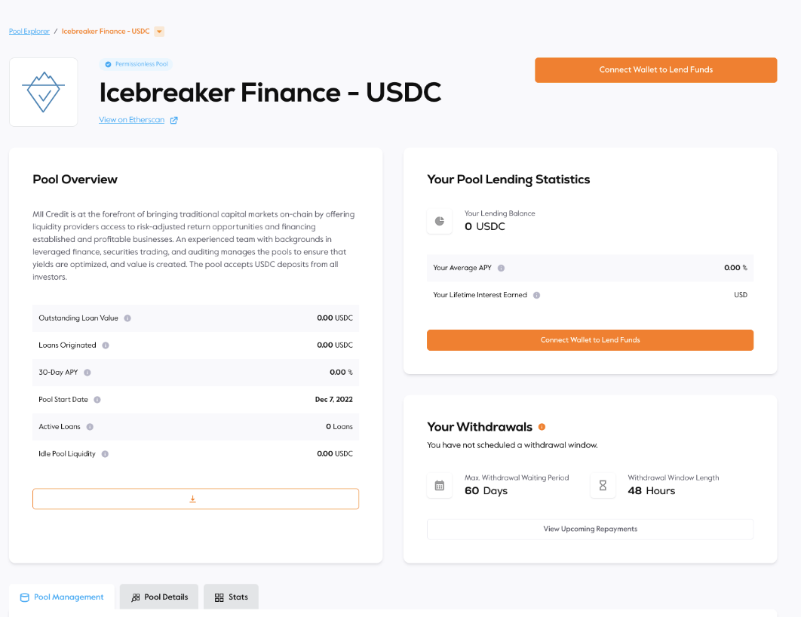
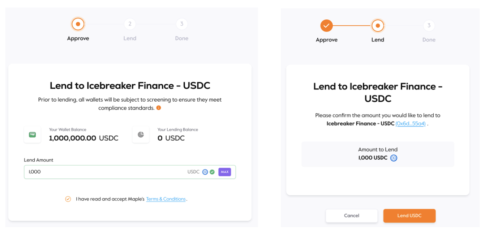
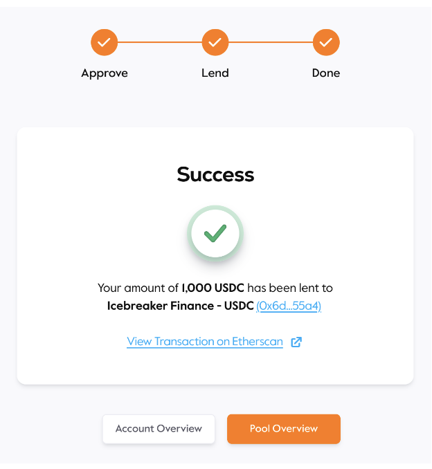

# Introduction

Lending is the easiest way to earn with Maple Finance. Lenders deposit into a pool to earn interest denominated in the pool's liquidity asset. This interest is determined by the loan terms set by the pool delegate and borrowers.

Before lending, lenders will need to prepare the pool denominated asset (e.g. USDC, wETH) in their Ethereum wallet and ETH for gas payments. Lenders will not need MPL tokens to participate in lending.

**How to Lend**

1\. Head to the Maple Webapp to see an overview of all our available pools. Click on a pool to see more details

<figure><figcaption></figcaption></figure>

2\. Once lenders have selected a pool to lend into, click on the pool name to arrive at the diligence and deposit stage. This page displays the pool’s strategy, manager, track record, and return profile.

<figure><figcaption></figcaption></figure>

3\. After reviewing the available information, it is now time to lend! Connect wallet to lend funds and follow the instructions to complete the deposit process.

<figure><figcaption></figcaption></figure>

4\. The success page appears, confirming the deposit has gone through!

<figure><figcaption></figcaption></figure>

5\. Lenders will then receive Pool LP (Liquidity Provider) Tokens in their wallet representing their share of the Lending Pool.
