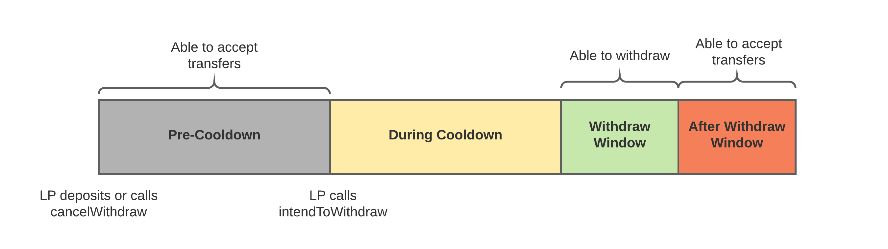

# How can I add or withdraw liquidity?

## Deposits

Lenders will be able to select [Lending Pools](how-do-liquidity-pools-work.md) to deposit funds to. By depositing, they receive a Maple Pool Token (MPT) representing their share of the pool.

As Lenders earn interest, it is reinvested by the Pool, enabling interest to compound. To withdraw liquidity, Lenders can exchange their MPT tokens for their share of capital.


While your interest is always available to be reinvested by the Pool to increase productivity, claiming interest and reinvesting the capital is the only way to increase your share of the Pool.


## Withdraws

While Lenders can claim their earned interest at any time, they must wait for their withdraw timer prior to removing their principle.&#x20;


Find more info on the pool cooldown [here](https://github.com/maple-labs/maple-core/wiki/FDT-Exit-Defense-Mechanisms).


Currently the lending period for a pool is set to 90 days (this is a [flexible pool parameter](../maple-protocol-v1.0.0.md#flexible-parameters)). This countdown is visible in the Maple WebApp UI.&#x20;

Incremental deposits to your lending position will add to your lending period on a weighted-average basis. For example, if you deposited $10,000 on day 1 and $10,000 on day 45, your total position of $20,000 would be locked for 67.5 days from the date of your second deposit.

Once the lending period has passed, lenders are able to initiate a withdrawal, triggering the 10 day cool down.  The 10 day cooldown period is a [global parameter](../maple-protocol-v1.0.0.md#global-parameters) that is in place as a security measure during withdrawal. After 10 days has passed, there will be a 48 hour window for Lenders to withdraw funds from the protocol. If a lender fails to withdraw during this period, they will need to initate another withdrawal that is subject to the same 10-day wait.&#x20;

