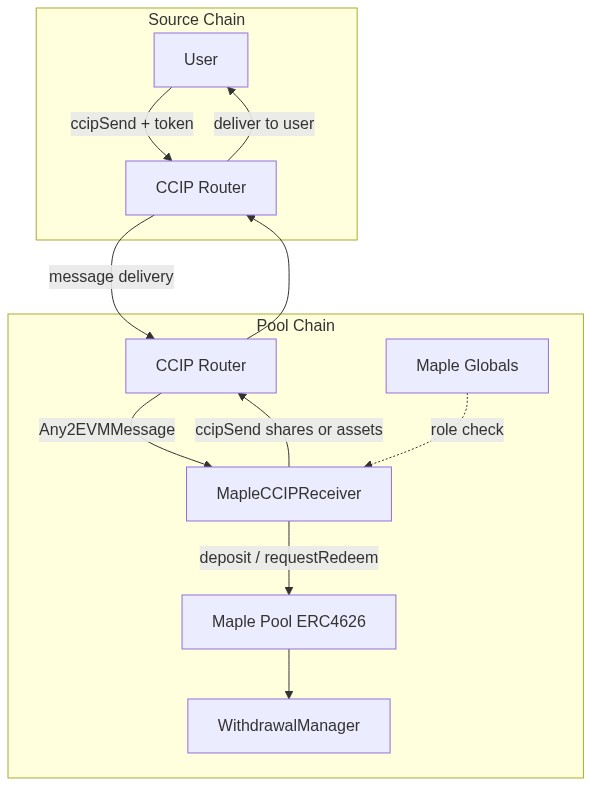
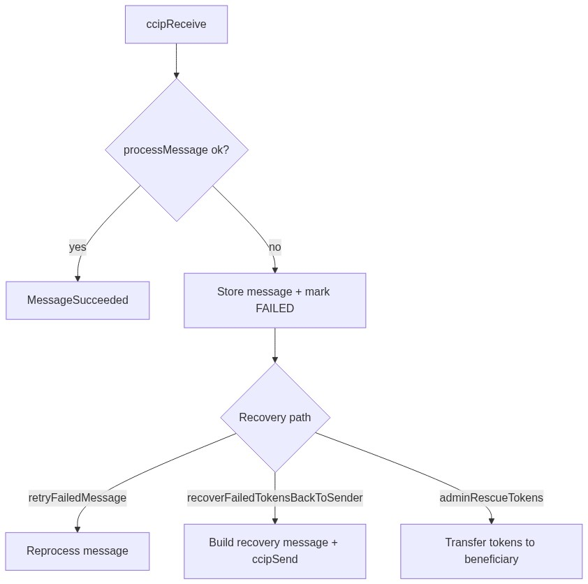

# Maple CCIP Receiver

The Maple CCIP Receiver is an upgradeable CCIP Any2EVM receiver that binds to a single Maple pool on the destination chain. It accepts chain transfers of either the pool asset (deposit flow) or the pool share token (redemption flow), validates the sender and pool, and returns the resulting tokens to the origin chain.

Contract: https://github.com/maple-labs/maple-cross-chain-receiver

## Architecture

### Components

- **CCIP Router**: Delivers inbound messages and sends outbound return messages.
- **MapleCCIPReceiver**: Validates messages, executes pool actions, tracks fees, and handles recovery.
- **Maple Pool (ERC-4626)**: Receives deposits and processes redemptions.
- **WithdrawalManager**: Queues and manages redemption requests.
- **Maple Globals**: Grants the `REDEMPTION_EXECUTOR` role used for redemption execution and request removal.

### High-level flow



## Message model and validation

### UniversalMessage data

Incoming CCIP messages include a data payload that is decoded into a `UniversalMessage`:

```solidity
struct UniversalMessage {
    bytes32 universalSenderAddress;
    address pool;
    bytes32 metaData;
}
```

- **universalSenderAddress**: A bytes32 universal address (EVM addresses are padded, SVM addresses are native 32 bytes).
- **pool**: Must match the single pool configured during initialization.
- **metaData**: Tag for offchain tracking and partner attribution.

### Validation gates

- **Sender validation**: The CCIP message sender is normalized into a bytes32 address and must match `universalSenderAddress`.
- **Pool binding**: `pool` in the message must match the receiver's configured pool.
- **Single token**: Only one token transfer per message is supported.
- **Token routing**:
  - Inbound token == pool share token -> redemption flow.
  - Inbound token == pool asset token -> deposit flow.
  - Any other token -> revert.

### Chain routing

The contract stores a `ChainType` for each CCIP chain selector. The chain type determines how outbound messages are formatted:

- **EVM**: `receiver` is an EVM address; extra args use `GenericExtraArgsV2`.
- **SVM**: `receiver` is the default SVM receiver; extra args use `SVMExtraArgsV1` with `tokenReceiver` set to the universal sender address.

## Core flows

### Deposit flow (asset token inbound)

1. CCIP Router calls `ccipReceive` with the asset token and encoded `UniversalMessage`.
2. Receiver validates sender, pool, and token, and checks that deposits are enabled.
3. Deposit fee (per token) is applied and stored as collected fees.
4. Receiver estimates CCIP fee for returning shares and verifies the contract has enough native tokens.
5. Receiver deposits assets into the pool via `deposit()` and receives shares.
6. Receiver sends the shares back to the origin chain via CCIP and emits `CrossChainDeposit`.

### Redemption flow (share token inbound)

1. CCIP Router calls `ccipReceive` with pool shares and encoded `UniversalMessage`.
2. Receiver validates sender, pool, and token, and checks that redemptions are enabled.
3. Redemption fee is computed in shares using `convertToExitShares`.
4. Receiver calls `requestRedeem()` and records the request (sender, chain selector, shares).
5. Receiver emits `CrossChainRedeem` with the request ID.
6. A `REDEMPTION_EXECUTOR` later calls `executeRedeemList()` to redeem shares into assets and return them via CCIP.

### Redemption request removal (share return)

`removeRedemptionRequests()` allows the `REDEMPTION_EXECUTOR` to remove queued requests and return shares to users if a redemption must be canceled. The caller funds CCIP fees for the return transfer, and any excess ETH is refunded.

### Message routing decision


## CCIP send details

Outbound transfers are sent with `IRouterClient.getFee()` and `IRouterClient.ccipSend()` using a `Client.EVM2AnyMessage`:

- **feeToken** is `address(0)`, so fees are paid in the native token of the pool chain.
- **EVM destinations** use `GenericExtraArgsV2` with `allowOutOfOrderExecution` enabled.
- **SVM destinations** use `SVMExtraArgsV1` with `tokenReceiver` set to the universal sender address.

## Failure handling and recovery

The receiver uses a defensive pattern to store failed messages for recovery:

- On failure, the full `Any2EVMMessage` is stored and marked `FAILED`.
- `retryFailedMessage()` retries processing using the stored message.
- `recoverFailedTokensBackToSender()` attempts a retry first, then sends tokens back to the original sender if retry fails.
- `adminRescueTokens()` is a last-resort admin path that transfers tokens directly to a beneficiary.



## Roles and permissions

- **DEFAULT_ADMIN_ROLE**
  - Configure chain types
  - Set deposit and redemption fees
  - Enable or disable deposits/redemptions
  - Withdraw tokens or native funds
  - Rescue tokens from failed messages
  - Authorize upgrades (UUPS)

- **REDEMPTION_EXECUTOR** (assigned in Maple Globals)
  - Execute queued redemptions
  - Remove redemption requests and return shares

- **Public**
  - Retry and recover failed messages (fees may be required)

## Fee model

- **Deposit fees**: Fixed per-token amount deducted from inbound assets before deposit.
- **Redemption fees**: Fixed per-token amount charged in assets, converted to share units and deducted from inbound shares.
- Collected fees accumulate in `s_tokenFeesBalances` and are withdrawable by an admin.

## Operational considerations

- The contract must maintain a native token balance to pay CCIP fees for outbound transfers.
- Chain selectors must be configured with a `ChainType` before messages can be sent.
- Redemptions require a configured `REDEMPTION_EXECUTOR` in Maple Globals.
- Use CCIP message IDs and emitted events (`MessageReceived`, `MessageSent`, `CrossChainDeposit`, `CrossChainRedeem`) for observability.
- For integrators: validate deposits and redemptions so the amount is greater than the configured fee for that token. Deposit fees and redemption fees are configured on the receiver contract, so amounts below the fee will revert.
