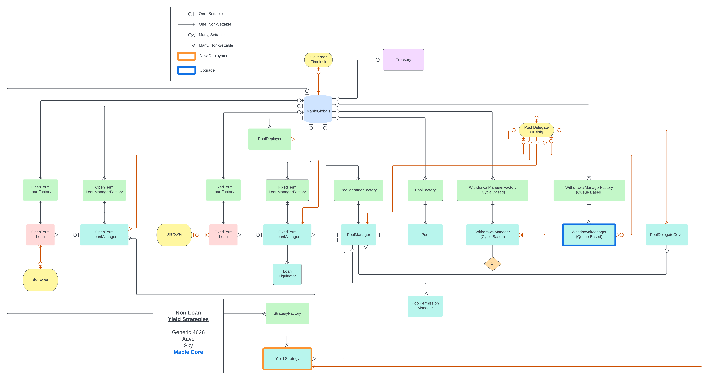

# Overview

In this section, the architecture of the Maple V2 protocol is outlined, including the rationale behind each decision.

# [Pool](../pools/pools.md)
The pool implements the vault standard ([ERC4626](https://erc4626.info/)) and its intentionally kept as simple as possible, containing mostly token and deposit/withdrawal functionality. It's the only contract that LPs need to interact with to participate in the protocol. Due to immutability, some of the logic is delegated to the contract called `PoolManager`, which is the only external facing contract that the Pool interacts with.

# [PoolManager](../pools/pool-manager.md)

Pools and PoolManagers currently have a one-to-one relationship (architecturally this is allowed to change), meaning that a single Pool contract is associated with a single PoolManager and vice versa. Its main responsibility is to hold almost all of the administrative functions, as well serve as the interface between the Pool and the other parts of the protocol architecture.

The main actors that interact with the PoolManager are the Pool Delegate, Governor and other Maple contracts. No external facing actor is expected to use the Pool Manager directly. The Pool Delegate uses the PoolManager to administrate strategies, performing actions such as funding and refinancing, and setting Pool parameters, such as liquidity cap and fees. Other contracts use the PoolManager to route calls to the Pool to perform operation such as withdrawals.

# LoanManagers (Primary yield strategy)

The LoanManager is used to keep track of all outstanding Loan accounting. A PoolManager can have many LoanManagers, but a given LoanManager only interacts and reports to a single PoolManager. The accounting is done on a separate contract and not directly on the Pool because it allows for future flexibility. With multiple LoanManagers it is possible to completely change the existing value accrue mechanism, or support multiple value accrual mechanisms in parallel in the future, without needing to migrate pool tokens. In the current architecture, LoanManagers are attached to the PoolManager as strategies via `addStrategy` using the appropriate LoanManager factory. There are two types of LoanManagers in the Maple protocol: fixed-term LoanManagers and open-term LoanManagers.

# Loans

A MapleLoan is the contract that represents the agreement between a Lender and a Borrower, defining all of the rules of the engagement. In it, all of the term details are set and enforced. This includes Loan terms, payment schedules, fee structures, and default conditions. Loans are the mechanism through which the revenue generated for Pool Delegates and the Maple protocol, as well as yield for Liquidity Providers. There are two types of Loans in the Maple protocol: fixed-term Loans and open-term Loans.

# External Strategies (Secondary yield strategy)
External strategies such as Aave and Sky are used to deposit cash into the pool to earn yield as a secondary yield source for the Pool. A Pool can have many external strategies but a strategy can only interact with onePool Manager.

# WithdrawalManager

In order to maximize capital efficiency, at any given time, the majority of the assets deposited by Liquidity Providers are directed towards funding loans and therefore, are not available to be withdrawn by LPs. Although depositors are entitled to the full value of their position, full liquidity might not be available at any given time. To address this in an equitable way, the WithdrawalManager contract is used.

WithdrawalManagers are developed to cater for a specific pool's needs with regards to liquidity management, giving Pool Delegates the flexibility to configure the best withdrawal mechanic for their needs.

# [Maple Globals](../singletons/globals.md)

MapleGlobals is a singleton contract responsible for holding protocol-wide parameters. The administrative actor of MapleGlobals is the `Governor` which can configure all the needed parameters in a central place. The `Governor` acts on behalf of the Maple DAO.

The MapleGlobals contract is also used to perform and control [time-locked](../admin-functions/timelocks.md) actions, such as smart contract upgrades, which can directly affect depositors.

# Factories

Within the Maple protocol there will be multiple instances of each contract described above, so for efficiency of deployment, a factory pattern is employed. Factories are contracts that are responsible to create new instances of specific contracts and to manage and perform upgrades. Factories are managed in an allowlist in MapleGlobals, maintained by the Governor. This allows protocol contracts to verify on-chain that contracts have been vetted by the Maple DAO. For example, a Loan Manager can check if it is funding a Loan that is part of the Maple protocol, as to avoid funding a Loan with malicious smart contract logic. Further, some (and eventually more/all) factories rely on MapleGlobals to determine if their caller is allowed to deploy an instance.
